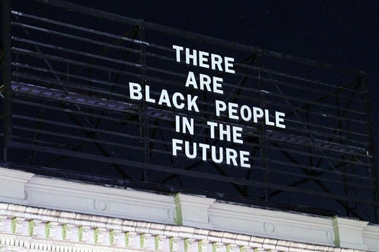

## A Glimpse into the Archive

> “The process of __remembering__ can be a practice which ‘transforms history from a judgement on the past in the name of a present truth to a __counter-memory__ that combats our current modes of truth and justice, helping us to understand and change the present by placing it in a new relation to the past’” - bell hooks

  
  <a href="https://www.pghcitypaper.com/Blogh/archives/2018/04/05/there-are-black-people-in-the-future-text-removed-from-east-liberty-public-art-project-at-behest-of-landlord" target="_blank">
    <i>There Are Black People In The Future (East Liberty)</i> - Alisha B. Wormsley, 2018
  </a>

  
  <a href="https://collection.cmoa.org/objects/e58baae3-ae12-41f1-878d-1e7f37d824e6" target="_blank">
    <i>Pittsburgh Friends of COFO Freedom Center</i> - Charles "Teenie" Harris
  </a>

  
  <a href="https://www.newspapers.com/clip/2027674/pg-aug-10-1964/" target="_blank">
    <i>Don Hamer, Pittsburgh Friends of COFO organizer, escapes bombing</i> - Pittsburgh Post-Gazette, 1964
  </a>

  
  <a href="https://www.crmvet.org/docs/650600_sncc_foslist.pdf" target="_blank">
    <i>Pittsburgh Friends of COFO Address</i> - 1965
  </a>

  
  <a href="https://www.google.com/maps/place/T-Mobile/@40.459516,-79.9250653,3a,75y,270.94h,71.56t/data=!3m6!1e1!3m4!1sTDVQ-Sjn43PEsO8hSB_HfA!2e0!7i16384!8i8192!4m13!1m7!3m6!1s0x887f81353f99f039:0x1b781340c3643b21!2s145+S+Highland+St,+Memphis,+TN+38111!3b1!8m2!3d35.127891!4d-89.9453686!3m4!1s0x8834f2737cbc0f0f:0x32db4b00d8035660!8m2!3d40.4595596!4d-79.9253779" target="_blank">
    <i>145 S. Highland Avenue</i> - Google Maps, 2021
  </a>

  
  <a href="https://collection.cmoa.org/objects/ac18a982-bba9-41d4-a0db-dc4fbd5d7e4d" target="_blank">
    <i>Exterior of Musician’s Club, Local 471, at Frankstown Avenue and Enterprise Street</i> - Charles "Teenie" Harris
  </a>

  
  <i>Frankstown Avenue and Enterprise Street</i> - Adrian Jones, 2021

  
  <a href="http://exhibit.library.pitt.edu/labor_legacy/MusiciansHistory471.htm" target="_blank">
    <i>History of the Pittsburgh Musicians' Union Local No. 471</i> - University of Pittsburgh
  </a>

  
  <a href="https://historicpittsburgh.org/islandora/object/pitt%3AUS-PPiU-ais199804/viewer" target="_blank">
    <i>The African American Jazz Preservation Society of Pittsburgh's Oral History of Local 471</i> - Historic Pittsburgh
  </a>

  
  <a href="https://www.maitrimedicinals.com/blog/2020/2/29/tribute-to-east-liberty-community-leader-jamil-brookins" target="_blank">
    <i>Tribute to East Liberty community leader Jamil Brookins</i> - Markita Wilburn
  </a>

  
  <a href="https://www.wtae.com/amp/article/living-room-blocks-east-liberty-traffic-penn-plaza-protest/9114220" target="_blank">
    <i>'Living room' blocks East Liberty traffic in Penn Plaza protest</i> - WTAE, 2017
  </a>

  
  <a href="https://www.pghcitypaper.com/Blogh/archives/2015/06/18 officials-say-east-liberty-is-among-best-examples-of-citys-renaissance-residents-disagree" target="_blank">
    <i>Equitable Development Conference Protest</i> - Pittsburgh City Paper, 2015
  </a>

