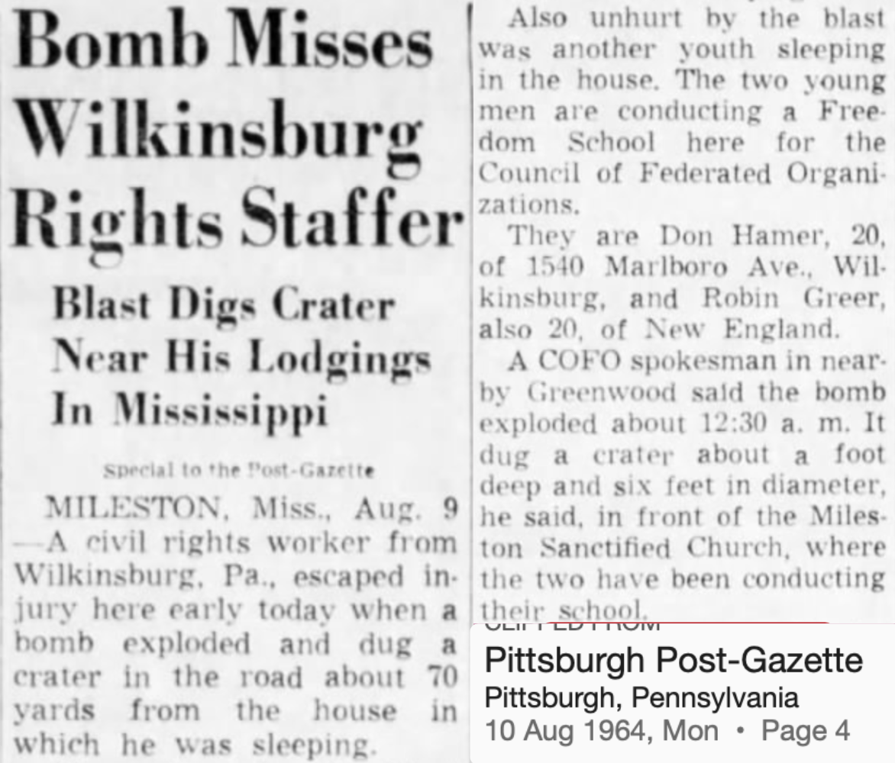
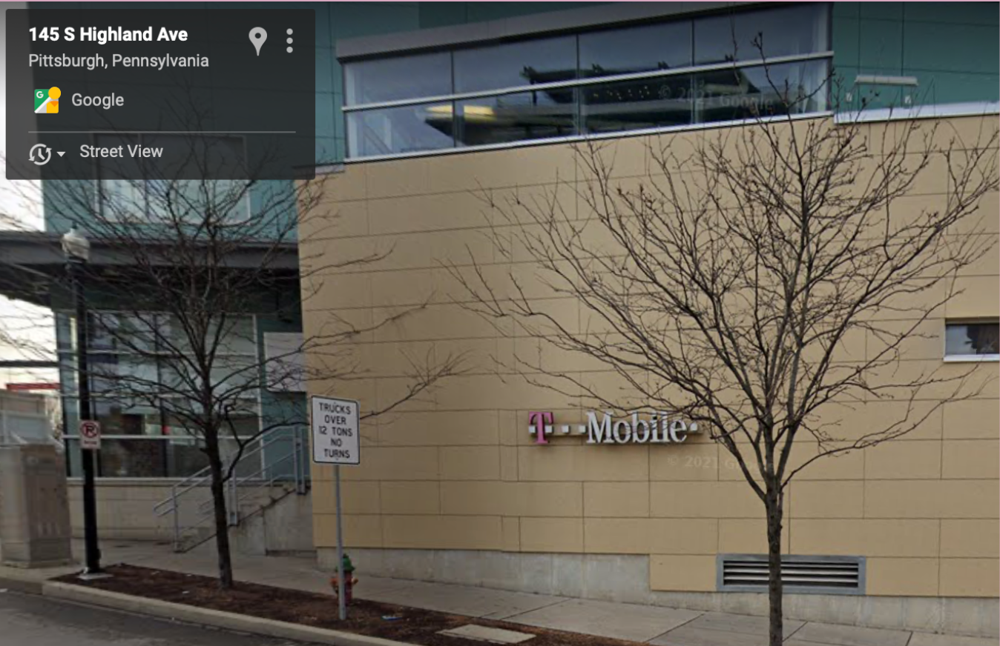

> “The process of __remembering__ can be a practice which ‘transforms history from a judgement on the past in the name of a present truth to a __counter-memory__ that combats our current modes of truth and justice, helping us to understand and change the present by placing it in a new relation to the past’” - bell hooks

 

[*There Are Black People In The Future (East Liberty) - Alisha B. Wormsley, 2018*](https://www.pghcitypaper.com/Blogh/archives/2018/04/05/there-are-black-people-in-the-future-text-removed-from-east-liberty-public-art-project-at-behest-of-landlord)

[*Pittsburgh Friends of COFO Freedom Center - Charles "Teenie" Harris*](https://collection.cmoa.org/objects/e58baae3-ae12-41f1-878d-1e7f37d824e6)

[*Pittsburgh Friends of COFO Address, 1965*](https://www.crmvet.org/docs/650600_sncc_foslist.pdf)

[*Don Hamer, COFO Organizer, escapes bombing*](https://www.newspapers.com/clip/2027674/pg-aug-10-1964/)

*145 S Highland Street Today*

[*Local 471 - Charles "Teenie" Harris*](https://collection.cmoa.org/objects/67633cad-fb78-41b5-bc31-fd2095687ab9) 
[History of the Pittsburgh Musicians' Union Local No. 471](http://exhibit.library.pitt.edu/labor_legacy/MusiciansHistory471.htm)

*Equitable Development Conference Protest - 2015* 
[Officials say East Liberty is among best examples of city's 'renaissance,' residents disagree](https://www.pghcitypaper.com/Blogh/archives/2015/06/18/officials-say-east-liberty-is-among-best-examples-of-citys-renaissance-residents-disagree)
