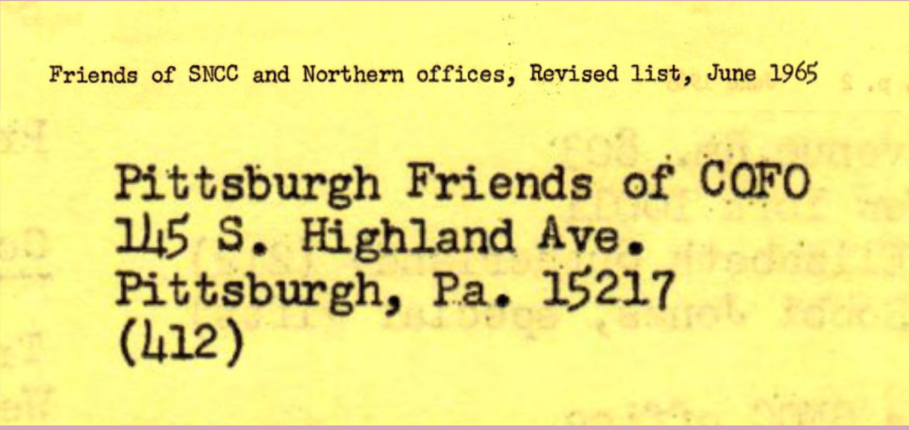

## A Glimpse into the Archive

> “The process of __remembering__ can be a practice which ‘transforms history from a judgement on the past in the name of a present truth to a __counter-memory__ that combats our current modes of truth and justice, helping us to understand and change the present by placing it in a new relation to the past’” - bell hooks

 
 
[*There Are Black People In The Future (East Liberty) - Alisha B. Wormsley, 2018*](https://www.pghcitypaper.com/Blogh/archives/2018/04/05/there-are-black-people-in-the-future-text-removed-from-east-liberty-public-art-project-at-behest-of-landlord)

[*Pittsburgh Friends of COFO Freedom Center - Charles "Teenie" Harris*](https://collection.cmoa.org/objects/e58baae3-ae12-41f1-878d-1e7f37d824e6)

[*Don Hamer, Pittsburgh Friends of COFO organizer, escapes bombing*](https://www.newspapers.com/clip/2027674/pg-aug-10-1964/)

[*Pittsburgh Friends of COFO Address, 1965*](https://www.crmvet.org/docs/650600_sncc_foslist.pdf)

[*145 S. Highland Avenue Today*](https://www.google.com/maps/place/T-Mobile/@40.459516,-79.9250653,3a,75y,270.94h,71.56t/data=!3m6!1e1!3m4!1sTDVQ-Sjn43PEsO8hSB_HfA!2e0!7i16384!8i8192!4m13!1m7!3m6!1s0x887f81353f99f039:0x1b781340c3643b21!2s145+S+Highland+St,+Memphis,+TN+38111!3b1!8m2!3d35.127891!4d-89.9453686!3m4!1s0x8834f2737cbc0f0f:0x32db4b00d8035660!8m2!3d40.4595596!4d-79.9253779)

[*Local 471 - Charles "Teenie" Harris*](https://collection.cmoa.org/objects/67633cad-fb78-41b5-bc31-fd2095687ab9) 

[History of the Pittsburgh Musicians' Union Local No. 471](http://exhibit.library.pitt.edu/labor_legacy/MusiciansHistory471.htm)

[The African American Jazz Preservation Society of Pittsburgh's Oral History of Local 471](https://historicpittsburgh.org/islandora/object/pitt%3AUS-PPiU-ais199804/viewer)

[Tribute to East Liberty community leader Jamil Brookins](https://www.maitrimedicinals.com/blog/2020/2/29/tribute-to-east-liberty-community-leader-jamil-brookins)

['Living room' blocks East Liberty traffic in Penn Plaza protest](https://www.wtae.com/amp/article/living-room-blocks-east-liberty-traffic-penn-plaza-protest/9114220)

[*Equitable Development Conference Protest, 2015*](https://www.pghcitypaper.com/Blogh/archives/2015/06/18/officials-say-east-liberty-is-among-best-examples-of-citys-renaissance-residents-disagree)
