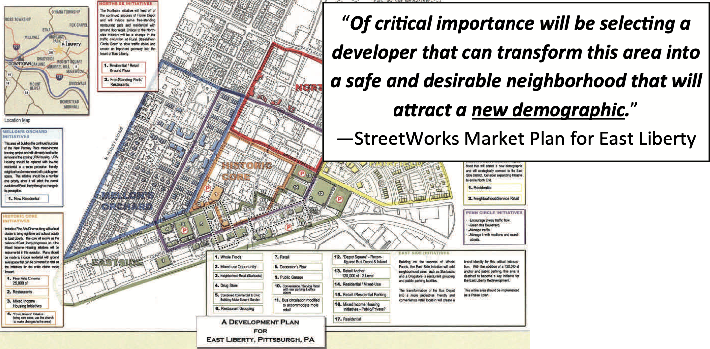

## The Project and Its Origins

[*Black Homes Matter* - Pittsburgh Fair Development Action Group](https://prrac.org/pdf/Black_Homes_Matter-Pittsburgh.pdf)

When I moved to Pittsburgh in 2017, my new neighbors made it a point to inform me of the shifting landscape between the city’s three rivers. Time and again, revitalization projects and sites of “innovation” had consistently treated Black residents with little regard. Neighborhoods that residents had known for decades were being forcefully transformed in the interest of maximizing profits for land owners. As I spoke with more people, read more accounts and walked through more spaces, I learned that the marks of gentrification are especially vicious and repugnant in East Liberty.

Gentrification not only displaces vulnerable people but it also furthers the erasure of precious history and culture. In this country, where being Black requires perpetually wrestling with a centuries-long disinformation campaign, knowledge of the past and sites of memory possess tremendous offensive and defensive value.

The idea for Looking Glass sprouted from my awareness of this multilayered struggle. Currently in the research and design phase, the project will culminate in a mobile application which will use augmented reality to create a gateway to an alternate version of East Liberty. Within the application, people will have access to a map of points of interest in East Liberty and when in range, they will be prompted to scan their surroundings to discover 3D elements which may reveal text, audio, images or video commemorating Black life and those who fought to preserve it. I envision this experience feeling something like a blend of a metal detector aided treasure hunt and a guided museum tour - if either took place in the middle of a city neighborhood. 

While I believe that many people stand to benefit from engaging with artifacts that tell a fuller story about East Liberty, my primary goal is to help Black Pittsburghers of all ages access a more expansive historical archive. It is my hope that this form of discovery and remembrance would help us cling to the truth that the beauty, strength and resilience of our forebears continues to dwell in us.
