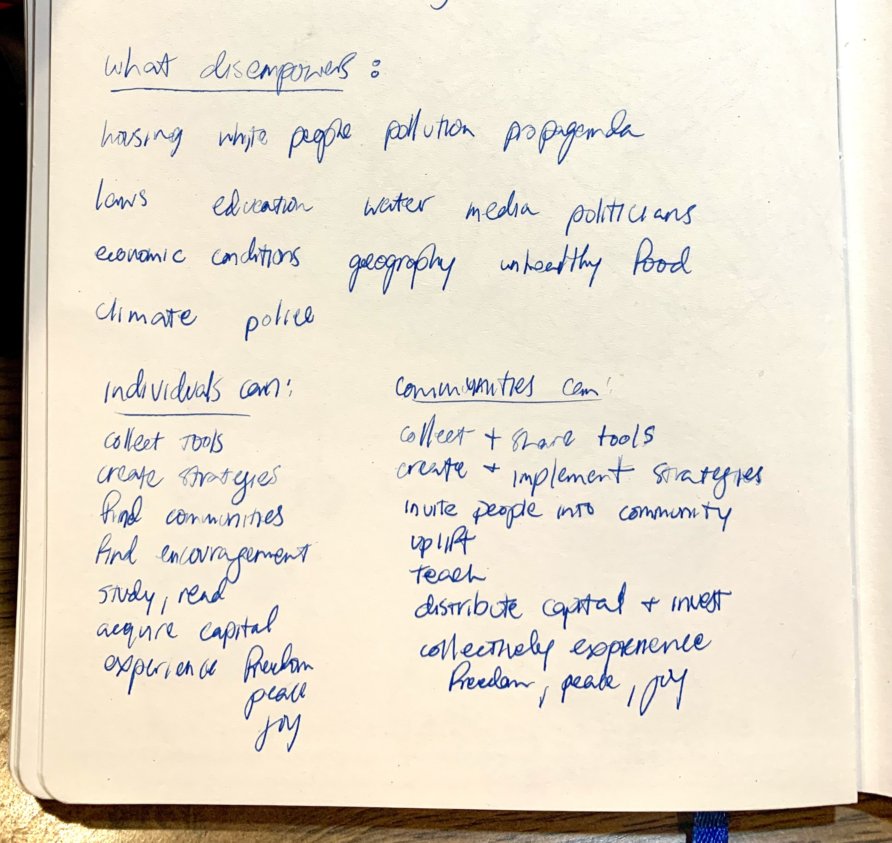

## Research and Development

### Rough Designs of the Experience 

### Early AR Tests: Model Manipulation and Interactivity

  <image src="./images/wip/billboard-test.gif" alt="Animated gif depicting a 3D billboard model being manipulated" width="500px" height="800px" />

  <image src="./images/wip/interactive-test.gif" alt="Animated gif depicting interactions with text objects in an AR scene" width="500px" height="800px" />

### Theory of Change Mapping

### The Earliest Brainstorming

